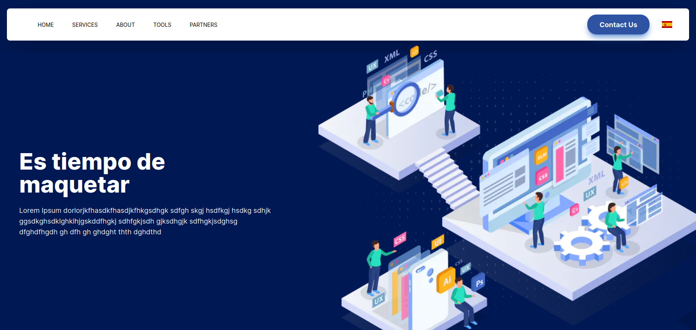

# 📃 Test React Frontend

- Las tecnologias utilizadas son NextJS, Tailwind CSS para los estilos y Typescript como lenguaje.

- La pagina esta maquetada segun el diseno proporcionado en: https://www.figma.com/file/MqhXViBaOjoPOEM1UOPhZ9/Test-React-Fronted?node-id=0%3A1&mode=dev

- Los datos del slider de servicios son tomados de un servicio externo (https://jsonplaceholder.typicode.com/posts) usando el hook useEffect y fetch API [[Ver archivo]](src/components/Carrousel.tsx)

- La version de la pagina es adaptable para movil.

- La pagina utiliza el modulo `next-intl` para las traducciones, solo fue traducido el Navbar y un titulo de la 3ra seccion de la pagina

- Se utilizo el Context API de React para guardar los datos extraidos de jsonplaceholder.typicode.com y luego accedidos desde la ultima seccion para ser mostrados [Ver Archivo del Context](src/context/ServicesContextProvider.tsx)

### 💡 Solucion
- Codigo fuente: https://github.com/leonardof02/test-react-frontend
- Preview: https://test-react-frontend-cd3sh3nup-leonardof02.vercel.app/en